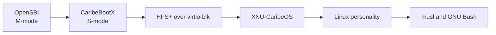

# CaribeOS Runtime for RV32IMACSU

Experimental XNU-based RV32IMACSU operating system with Sv32, SMP, a Linux
personality, real processes, and interactive GNU Bash.

CaribeOS is an independent experimental project. It is not affiliated with,
endorsed by, or supported by Apple Inc. It is not macOS, is not a complete
Darwin distribution, and is not production ready.

This repository owns the runtime side of the port: CaribeBootX, HFS+ boot
integration, the RV32 userland/initrd, musl and Bash build recipes, QEMU launch
targets, serial assertions, and process/SMP gates. The companion XNU repository
owns the kernel implementation.

## Required Boot Chain

```text
OpenSBI (M-mode) -> CaribeBootX (S-mode) -> XNU-CaribeOS (S-mode)
```



The supported QEMU path is `-bios default -kernel build/caribe_rv32.elf`.
The obsolete direct-kernel `-bios build/caribe_rv32.bin` path is unsupported.

CaribeBootX receives the OpenSBI DTB, initializes UART, Sv32 identity mappings,
minimal traps/timer state, and virtio-blk. It reads HFS+, honors a
`kernel=/kernel.elf` setting in `com.apple.Boot.plist` when present, otherwise
uses `/kernel.elf`, and transfers control to XNU-CaribeOS.

## Current Status

| Status | Capability |
|---|---|
| Implemented | QEMU `virt` RV32 boot through OpenSBI and CaribeBootX, virtio-blk, HFS+ kernel loading, DTB handoff |
| Implemented | Sv32 XNU boot, two-hart kernel SMP, per-hart state, IPI/timer, remote TLB coherence, dual-CPU kernel scheduling |
| Implemented | Task/thread-backed process model, fork/exec/exit/wait, per-process pmap/FDs, signals, `rt_sigreturn`, pipes and pipelines |
| Implemented | Blocking UART TTY, selected job control, musl 1.2.5 and interactive GNU Bash 5.3.5 |
| Experimental | Userspace on CPU1, long process stress, IOKit probes, dynamic ELF support |
| Partial | Linux syscall compatibility, POSIX semantics, drivers, IOKit service matching, filesystem surface |
| Not implemented | Production security, writable general filesystem, networking, broad hardware support, macOS compatibility |

The Linux personality maps selected Linux-compatible syscalls onto XNU. It
does not contain a Linux kernel.

## Quick Verification

From this directory in PowerShell:

```powershell
.\testproject.ps1 -Mode up -Seconds 45
.\testproject.ps1 -Mode gates -Seconds 50
.\testproject.ps1 -Mode interactive -Seconds 120
.\testproject.ps1 -Mode process-stability -Seconds 300
.\testproject.ps1 -Mode process-stress -Seconds 300 -StressRounds 10000
```

`testproject.ps1` finds the sibling XNU tree, rebuilds the current kernel, runs
the selected QEMU boots, and performs semantic assertions over serial output.
See [TESTING.md](TESTING.md).

## Preserved Tranche 201 Kernel

- File: `xnu-caribeos-rv32-full-stage0.elf`
- Size: 945,004 bytes
- SHA-256: `c63fe4bfbaeaf674a4092c1c579cfe472fc433d2e89b4f55307484ed820e595e`

Generated ELF, initrd, HFS+, DTB, logs, third-party source archives, and build
trees are intentionally excluded from normal Git. They are preserved in the
local raw snapshot or packaged as private release assets.

## Documentation

- [BUILDING.md](BUILDING.md)
- [RUNNING_QEMU.md](RUNNING_QEMU.md)
- [TESTING.md](TESTING.md)
- [RESTORE.md](RESTORE.md)
- [BOOTFLOW_HFSPLUS.md](BOOTFLOW_HFSPLUS.md)
- [docs/BOOT_CHAIN.md](docs/BOOT_CHAIN.md)
- [docs/DEVELOPER_PREVIEW.md](docs/DEVELOPER_PREVIEW.md)
- [docs/TRANCHE_201_RELEASE_NOTES.md](docs/TRANCHE_201_RELEASE_NOTES.md)
- [docs/TRANCHE_201_EVIDENCE.md](docs/TRANCHE_201_EVIDENCE.md)
- [ROADMAP.md](ROADMAP.md), [SUPPORT.md](SUPPORT.md), and [SECURITY.md](SECURITY.md)
- [CONTRIBUTING.md](CONTRIBUTING.md) and [CODE_OF_CONDUCT.md](CODE_OF_CONDUCT.md)
- [docs/DEVELOPMENT_WITH_CODEX.md](docs/DEVELOPMENT_WITH_CODEX.md) and [CITATION.cff](CITATION.cff)
- [docs/SOURCE_TREE.md](docs/SOURCE_TREE.md)

The companion kernel source is
[h0nda1337/caribeos-xnu-rv32](https://github.com/h0nda1337/caribeos-xnu-rv32).

When reporting a problem, include the selected mode, kernel SHA-256, tool
versions, complete serial log, CPU count, and whether UP or SMP failed. Never
include credentials or proprietary SDK material.
