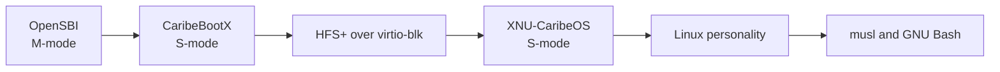

# Boot Chain

The only supported Tranche 201 chain is:



## OpenSBI

QEMU supplies OpenSBI with `-bios default`. OpenSBI remains resident in M-mode,
starts the boot hart, exposes SBI services, and passes the live DTB address to
CaribeBootX. The runtime does not redistribute QEMU or OpenSBI firmware.

## CaribeBootX

QEMU loads `build/caribe_rv32.elf` with `-kernel`; it is not used as firmware.
CaribeBootX establishes its S-mode stack and trap vector, initializes UART,
parses the DTB, installs the minimum Sv32 identity map, initializes timer/trap
state, and accesses the legacy virtio-blk device used by the reference machine.

The loader reads the HFS+ catalog with the real `HFSPlusFileRecord` layout. It
looks for `com.apple.Boot.plist`, honors a `kernel=/kernel.elf` setting when
present, and otherwise falls back to `/kernel.elf`.

## XNU-CaribeOS

CaribeBootX transfers the DTB and boot context to the RV32 XNU entry. XNU then
takes ownership of Sv32, initializes kernel VM and CPUs, starts the secondary
hart through OpenSBI HSM, and enters the kernel scheduler. The Linux personality
starts the tested initrd processes; it does not boot or embed a Linux kernel.

## Supported QEMU Contract

The runner expands the full command, whose essential form is:

```text
qemu-system-riscv32 -M virt -m 256 -bios default \
  -kernel build/caribe_rv32.elf ...
```

The historical `-bios build/caribe_rv32.bin` form is unsupported because it
bypasses the required firmware/privilege handoff and used incorrect addresses.

See `RUNNING_QEMU.md` for commands and `BOOTFLOW_HFSPLUS.md` for the filesystem
implementation details.
